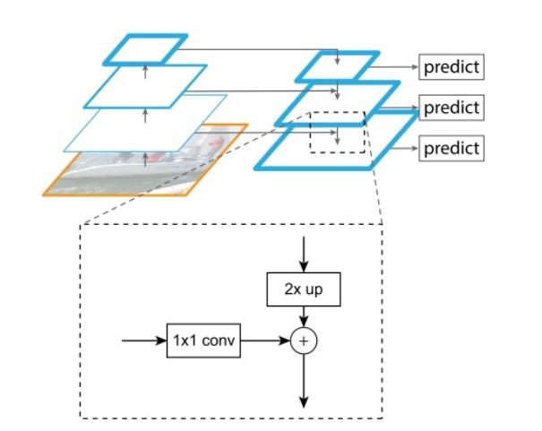
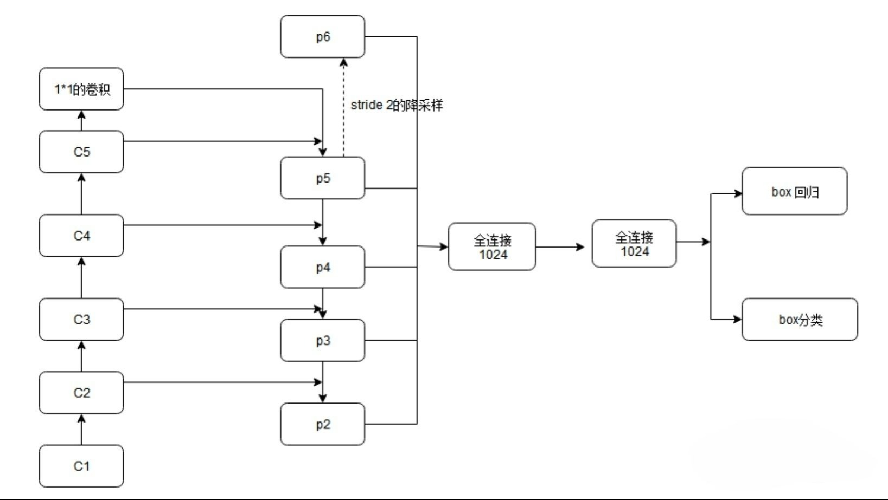
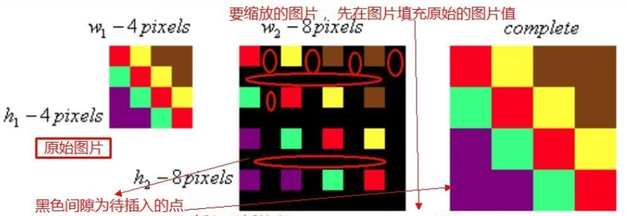
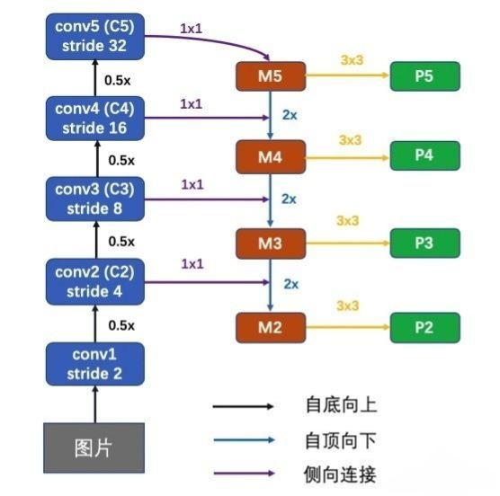

# FPN（feature pyramid networks）

**【概述】**

论文主要解决的问题是目标检测在处理多尺度变化问题是的不足，许多目标检测算法都只采用顶层特征做预测，由于低层的特征语义信息比较少，但目标位置准确；高层的特征语义信息比较 丰富，但目标位置粗略。FPN在不同的特征层做独立的预测，能够在增加较少计算量的前提下融合低分辨率语义信息较强的特征图和高分辨率语义信息较弱但空间信息丰富的特征图。

**自底向上**：前馈backbone的一部分，每一级往上使用降采样。

降采样（下采样）：1.使得图像符合显示区域的大小；2.生成对应图像的缩略图。

使用池化操作实现，达到降低特征的维度，并保留有效的信息，一定程度上避免过拟合。

下图为Faster R-CNN的网络结构，左列ResNet用每级最后一个Residual Block的输出，记为{C1,C2,C3,C4,C5}。

FPN用2~5级参与预测(因为第一级的语义还是太低了)，{C2,C3,C4,C5}表示conv2，conv3，conv4和conv5的输出层(最后一个残差block层)作为FPN的特征，分别对应于输入图片的下采样倍数为{4，8，16，32}。

**自顶向下**：采用上采样的方式。

上采样：图像插值，放大原图像,从而可以显示在更高分辨率的显示设备上。

使用最近邻插值法可以在上采样的过程中最大程度地保留特征图的语义信息(有利于分类)，从而与自底向上过程中相应的具有丰富的空间信息(高分辨率，有利于定位)的特征图进行融合，从而得到既有良好的空间信息又有较强烈的语义信息的特征图。

具体过程为：

侧向连接将上采样的结果和自底向上生成的相同大小的feature map进行融合，具体操作是C5层先经过1 x 1卷积，改变特征图的通道数(文章中设置d=256，与Faster R-CNN中RPN层的维数相同便于分类与回归)。M5通过上采样，再加上(特征图中每一个相同位置元素直接相加)C4经过1 x 1卷积后的特征图，得到M4。这个过程再做两次，分别得到M3，M2。

M层特征图再经过3 x 3卷积(减轻最近邻近插值带来的混叠影响，周围的数都相同)，得到最终的P2，P3，P4，P5层特征。与原来自底向上的卷积结果C2,C3,C4,C5相对应。