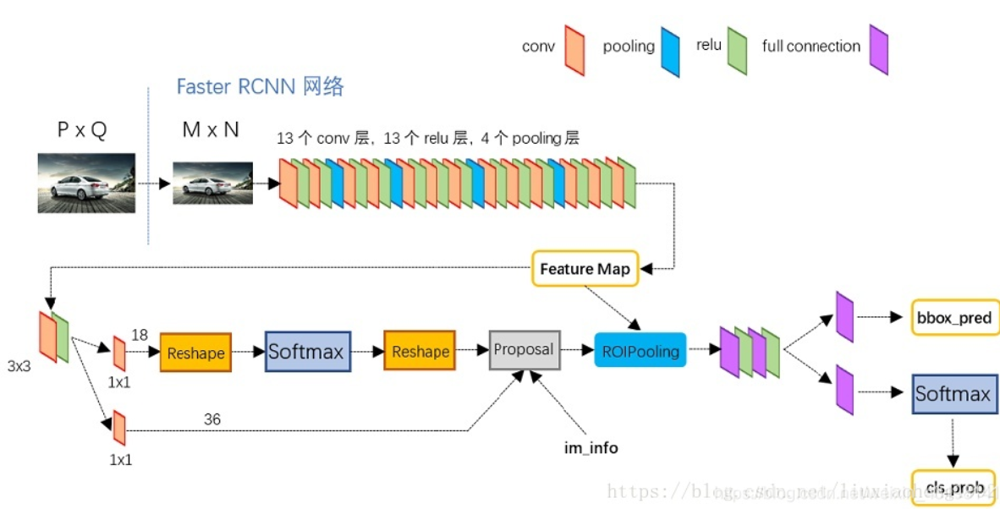
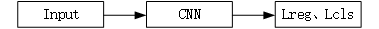
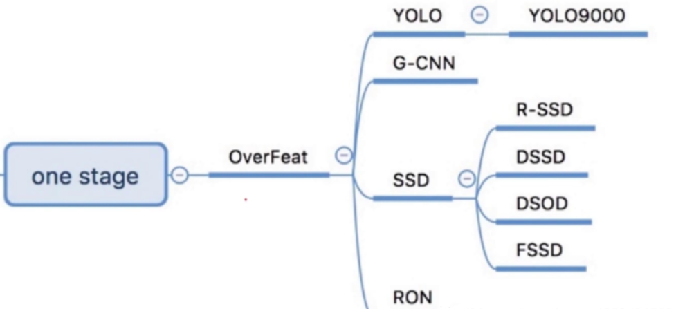
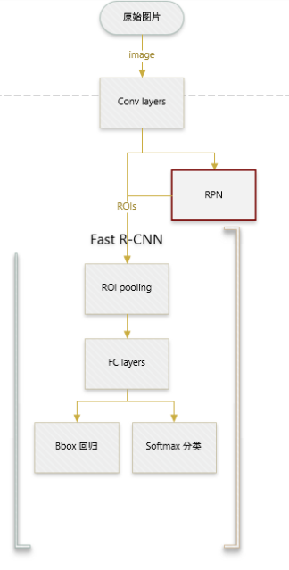
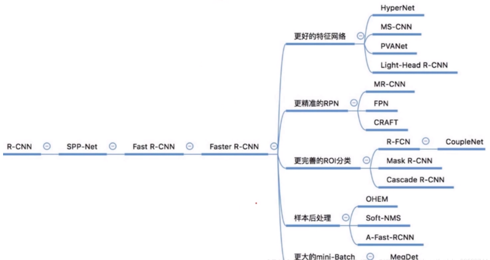
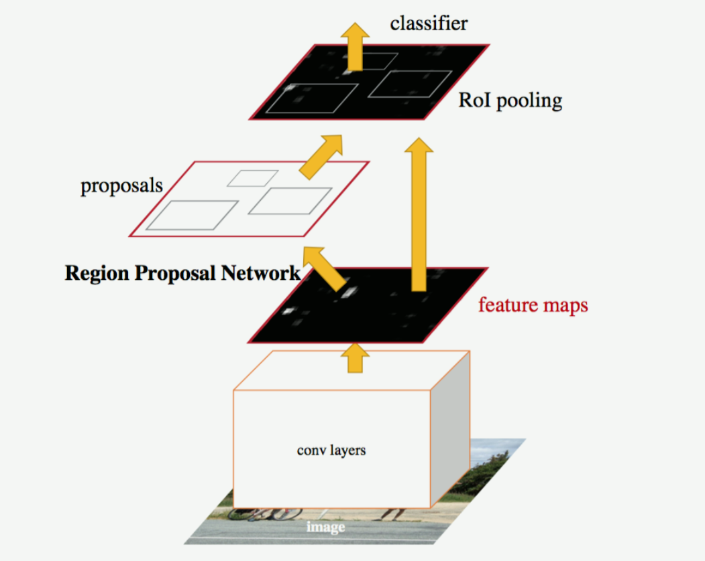
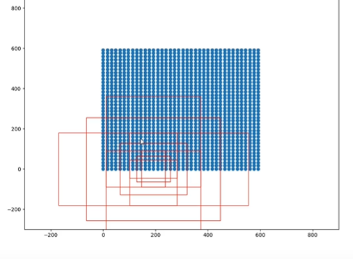
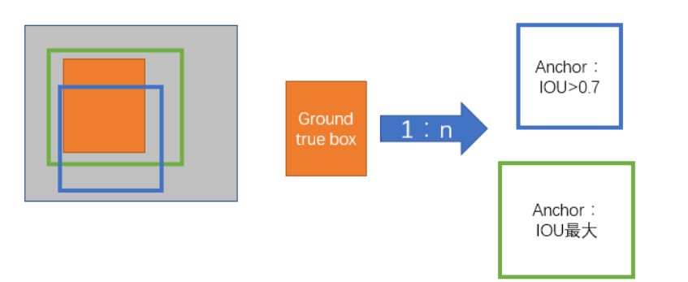

# Faster R-CNN: Towards Real-Time Object Detection with Region Proposal Networks

**摘要：**目前最先进的目标检测网络需要先用区域建议[算法](http://lib.csdn.net/base/datastructure)推测目标位置，像SPPnet[7]和Fast R-CNN[5]这些网络已经减少了检测网络的运行时间，这时计算区域建议就成了瓶颈问题。本文中，我们介绍一种区域建议网络（Region Proposal Network, RPN），它和检测网络共享全图的卷积特征，使得区域建议几乎不花时间。RPN是一个全卷积网络，在每个位置同时预测目标边界和objectness得分。RPN是端到端训练的，生成高质量区域建议框，用于Fast R-CNN来检测。通过一种简单的交替运行优化方法，RPN和Fast R-CNN可以在训练时共享卷积特征。对于非常深的VGG-16模型[19]，我们的检测系统在GPU上的帧率为5fps（包含所有步骤），在PASCAL VOC 2007和PASCAL VOC 2012上实现了最高的目标检测准确率（2007是73.2%mAP，2012是70.4%mAP），每个图像用了300个建议框。[代码](https://github.com/ShaoqingRen/faster_rcnn)已公开。

【学习参考地址】：

https://arxiv.org/abs/1506.01497

https://blog.csdn.net/u011326478/article/details/52872614

https://blog.csdn.net/weixin_44791964/article/details/105739918

https://www.bilibili.com/video/BV1BK41157Vs?p=7

https://github.com/bubbliiiing/faster-rcnn-pytorch

【主要架构】：

Faster R-CNN主要两个模块组成。第一个模块是提议区域的深度全卷积网络。第二个模块是使用提议区域的Fast R-CNN检测器。是典型的Two-stage检测算法。

流程：输入数据（image input) --------> 卷积层提取特征，得到feature map ------>RPN层，输出比较精确ROIs------>对输出ROIs映射到ROIping的feature map进行回归分类。

**One-stage**：直接回归物体的类别概率和位置坐标值（无region proposal），但准确度低，速度相对two-stage快。

直接对输入的图像做卷积，回归，没有使用RPN网络，算法的速度更快，但是精度相对Two-stage较低。

典型One-stage网络：

**Two-stage**:先使用算法生成一系列的候选框，然后利用卷积神经网络做分类回归。

首先输入一张图片，通过卷积神经网络对图片进行特征提取，然后通过RPN网络来生成并选取候选区域，同时完成对区域的初步位置预测。接下来通过ROI pooing层对预测到的候选区域进行精确定位和修正，然后通过全连接层（FC）得到相应的特征向量，最后通过分类和回归操作来完全确定目标的类别和位置（候选矩形框的坐标，（x,y,w,h),其中(x,y)为矩形框的左上角顶点坐标，w和h为矩形的长和宽）

典型的Two-stage:

**Region Proposal Networks**

RPN网络输入任意尺寸的图像，输出一系列矩形的目标proposals，每个proposal都带有一个objectness分数。

首先图片在输入网络后，依次经过一系列conv+relu得到的feature map。用来给后续进行选取建议框。并且此时坐标依然可以映射回原图。然后在feature map上的每个特征点预测多个region proposals。

首先图片在输入网络后，依次经过一系列conv+relu得到的feature map。再在经过卷积层提取到的feature map上用一个3x3的slide window，去遍历整个feature map,在遍历过程中每个window中心按rate，scale（1:2,1:1,2:1）生成9个anchors，然后再利用全连接对每个anchors做二分类（是前景还是背景）和初步bbox regression。具体作法是：把每个特征点映射回映射回原图的感受野的中心点当成一个基准点，然后围绕这个基准点选取k个不同scale、aspect ratio的anchor，即选取矩形框。一般对每个锚点选取九个矩形框，3个竖着，3个横着，还有3个正方形。

**划分正负样本**

考察训练集中的每张图像（含有人工标定的ground true box） 的所有anchor，对每一个anchor使用一个二分类的标签。

1.对每个标定的ground true box区域，与其重叠比例最大的anchor记为 正样本（每个标定的ground true至少有一个正样本）。

2.对1中剩余的anchor，如果其与某个标定区域重叠比例大于0.7，记为正样本，可能每个ground true box对应的正样本不止一个，但是每个正样本只可能对应一个ground true box；如果其与任意一个标定区域的重叠比例小于0.3则标定为负样本。

**损失函数**

