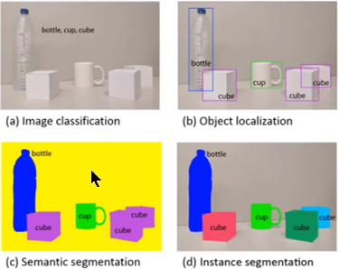
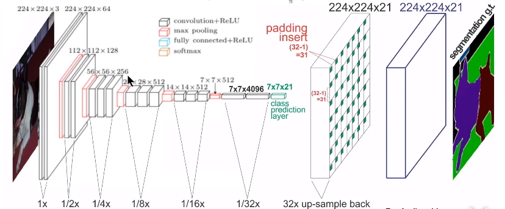
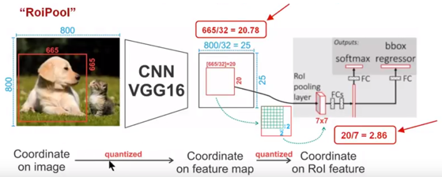
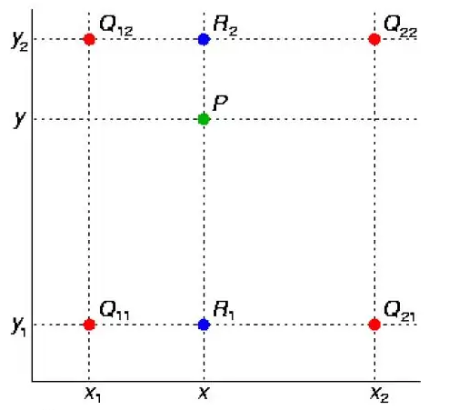
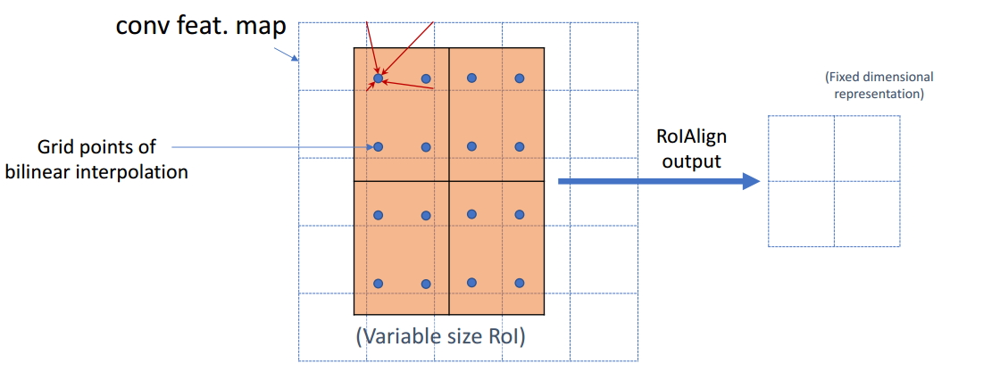

# Mask R-CNN

论文链接：https://arxiv.org/abs/1703.06870

**Mask R-CNN是一个非常灵活的框架，可以增加不同的分支完成不同的任务，可以完成目标分类、目标检测、语义分割、实例分割**

**实例分割&语义分割**

图中的c和d图，c图是对a图进行语义分割的结果，d图是对a图进行实例分割的结果。两者最大的区别就是图中的"cube对象"，在语义分割中给了它们相同的颜色，而在实例分割中却给了不同的颜色。也就是说实例分割需要在语义分割的基础上对同类物体进行更精细的分割。

**算法思想**：Faster-rcnn + FCN（RPN + ROIAlign + Fast-rcnn + FCN）

**算法框架**：

1.输入一幅你想处理的图片，然后进行对应的预处理操作，或者预处理后的图片；
2.将其输入到一个预训练好的神经网络中（ResNeXt等）获得对应的feature map；
3.对这个feature map中的每一点设定预定个的ROI，从而获得多个候选ROI；
4.将这些候选的ROI送入RPN网络进行二值分类（前景或背景）和BB回归，过滤掉一部分候选的ROI；
5.对这些剩下的ROI进行**ROIAlign**操作（即先将原图和feature map的pixel对应起来，然后将feature map和固定的feature对应起来）；
6.对这些ROI进行分类（N类别分类）、BB回归和**MASK生成**（在每一个ROI里面进行FCN操作）。

## FCN

FCN算法可以对图片中的目标进行准确的分割。其总体架构如上图所示，它是一个端到端的网络，主要的模快包括卷积和去卷积，即先对图像进行卷积和池化，使其feature map的大小不断减小；然后进行反卷积操作，即进行插值操作，不断的增大其feature map，最后对每一个像素值进行分类。从而实现对输入图像的准确分割。

## ROI Pooling

在RCNN中，为了得到固定大小（7X7）的feature map，我们需要做两次量化（取整）操作。

第一次是图像坐标 —> feature map坐标

第二次是feature map坐标 —> ROI feature坐标

如图输入一张800x800的图像，狗的Bounding Box大小为665x665,经过卷积池化操作后，在VGG16网络中，有5个池化操作，每个都是2pooling,则提取出feature map的大小为800/32 x 800/32 = 25 x25，然后狗的Bounding Box对应到feature上则有 665/32 x 665/32     = 20.78 x20.78，由于像素值没有小数，采用量化取整，结果为20 x 20,产生量化误差。

由于feature map中有不同大小的ROI，但是我们后面的网络却要求固定输入大小，因此，我们需要将不同大小的ROI转化为固定的ROI feature，在这里使用的是7x7的ROI feature，则需要对20 x 20的ROI映射成7 x7 的ROI feature, 20/7 = 2.86 ，再次量化取整，又产生量化误差。

高层特征感受野较大，映射回原图像误差就更大。

## ROIAlign

ROIAlign技术并没有使用量化操作，直接采用浮点数。

采用**双线性插值**法:

蓝色的虚线框表示卷积后获得的feature map，黑色实线框表示ROI feature，最后需要输出的大小是2x2，那么我们就利用双线性插值来估计这些蓝点处所对应的像素值，最后得到相应的输出。